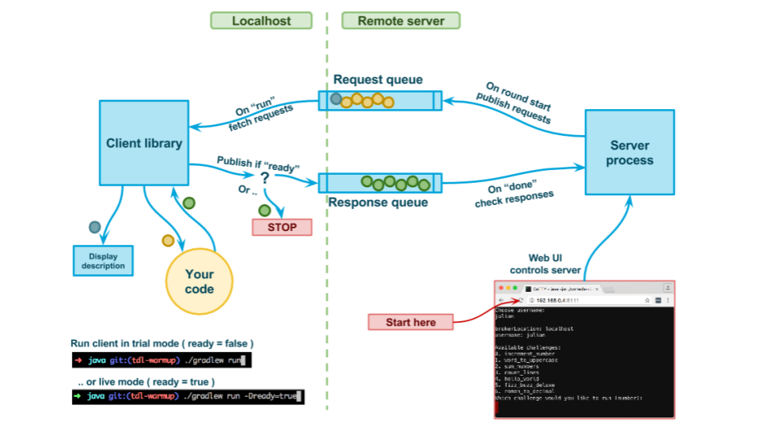

# tdl-client-spec

Describes the interaction between the client and the challenge server.

The interaction has two major components:
1. A queue system ( `./queue/QueueRunner.feature` )
2. A challenge session API ( `./runner/ChallengeSession.feature` )

The queue system is used to serve requests and receive responses, while the challenge API is used to manage to workflow and receive feedback.



## Supported protocols

| Protocol              | Port   |
| --------------------- | ------ |
| OpenWire              | 61616  |
| AMQP 1.0              | 5672   |
| STOMP                 | 61613  |
| STOMP over WebSockets | 61614  |
| MQTT                  | 1883   |


## Include Spec in language client

The best way to use the Spec is to include it as Git submodule in your language client and then run the Spec with the Cucumber library associated with the language.

```bash
export SPEC_LOCATION=./src/test/resources/tdl/client/
export SPEC_VERSION=v0.3

# Checkout
git submodule add git@github.com:julianghionoiu/tdl-client-spec.git $SPEC_LOCATION
git submodule update --init

# Switch to tag
pushd . 
cd $SPEC_LOCATION
git checkout $SPEC_VERSION
popd

# Commit
git commit $SPEC_LOCATION -m "Added spec submodule"
```

In order to have a complete setup, I recommend stubbing the external dependencies using:
- A test copy of the ActiveMq broker: https://github.com/julianghionoiu/tdl-client-test-broker
- Wiremock to represent the challenge server: https://github.com/julianghionoiu/tdl-client-test-wiremock


## To release a new version spec

```bash
git add *
git commit -m "Describe the changes"
git tag -a v0.11 -m "Describe the version"
git push --tags
```